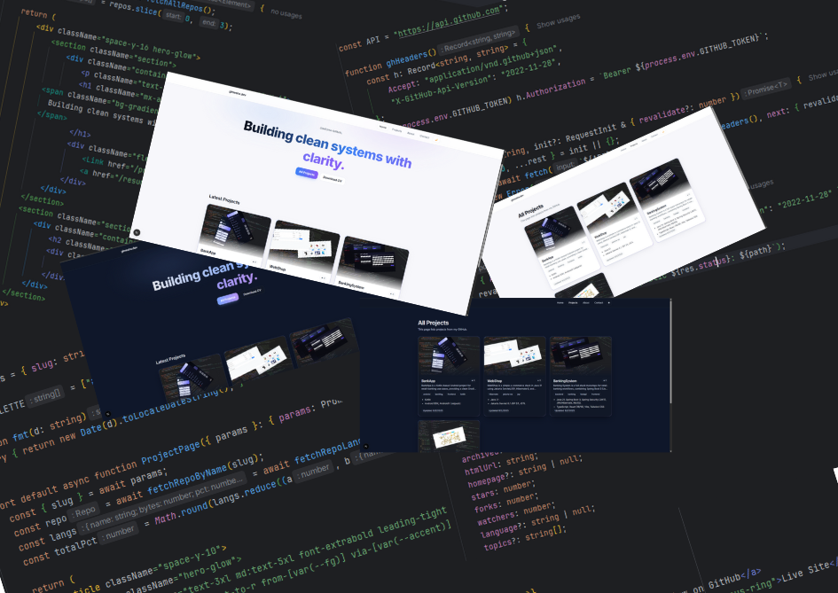

# Gimesha Portfolio — Next.js 15 + MDX (official) + Tailwind v4

This starter follows **official docs** for MDX and Tailwind on Next.js.

## Quick start
```bash
npm i
npm run dev
# http://localhost:3000
```

### Tech
- **Next.js 15** + **React 19**
- **MDX via @next/mdx** (App Router)
- **Tailwind v4** (official Next.js guide) + `@tailwindcss/typography`

### Files to edit
- Content MDX: `content/projects/*.mdx`, `content/about.mdx`
- Pages: `app/*`
- Global CSS: `app/globals.css`

### Deploy
- Push to GitHub and import to Vercel. Add domain `gimesha.dev`.
